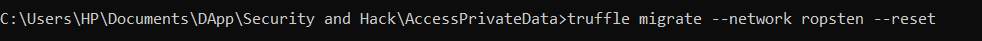
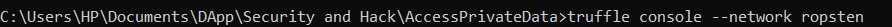

Accessing Private Data  
All data on a smart contract can be read including private data. 
1)migrate the contract to Ropsten network 
2)start a truffle console that is connected to the ropsten test network 
3)get the contract and its address: 
4)execute the addSomeUser() function 
5)get the state variable that is stored in slot 0 , because the first declared variable is dynamic array so the length of array is stored in slot 0 
6)array elements is stored in slots starting from hash(0) 
The returning value is actually username of first User that has been pushed to array 

7)converting bytes32 username to alphabet 
8) in the next slot , the password of first user has been stored : (add slot hash by 1 to access next slot) 
In the next slot , username of second user has been stored and so on … 9)the mapping has been declared in slot 1 , so for accessing data we should  
calculate the hash of mapping index with this slot 
10)uint value(block.timestamp) that has mapped to index 1 (the second user that has been pushed to structure ) 

